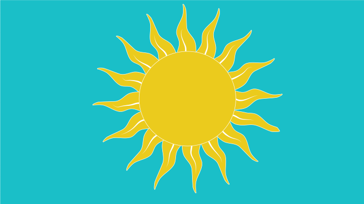

# SunBlocker

Welcome to the GitHub repository for my published app SunBlocker! This repository contains all the source code and relevant files for my amazing app.

**Getting Started**

*You can download the app from the app store to try it out. 
https://apps.apple.com/us/app/sunblocker-sunscreen-timer/id1670183247

**Features**

* Sets timer that alerts the user when it's time to reapply sunscreen.
* Simple interface that will make it easy for users to set a time that works best for them. 
    *The app has three options: Auto, Swim/Sweat, and Custom. 
    *Auto timer sets the timer for 2 hours which is the recommended time to reapply sunscreen. 
    *The Swim/sweat button sets the time for 45 minutes which is the recommended time to reapply if you're going for a swim or sweating. 
    *The Custom button allows you to select a time to reapply.  
* Users must allow the app to send notifications to get alerted when the timer is up. If the user denies giving this access they will not be alerted. This can be changed in the notification setting on the iPhone settings.
* Has a learning section that gives you info on why applying sunscreen is important. 
* MORE FEATURES COMING SOON!

**Support and Feedback**

*If you encounter any issues or have suggestions for improvement, please open an issue on this repository. I appreciate your feedback and will actively address any concerns.
